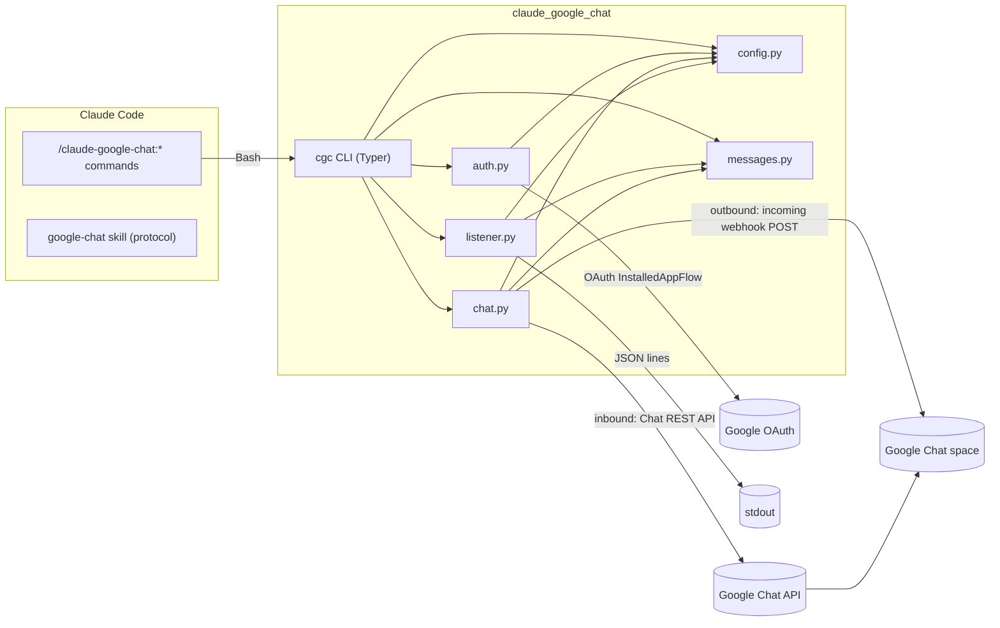
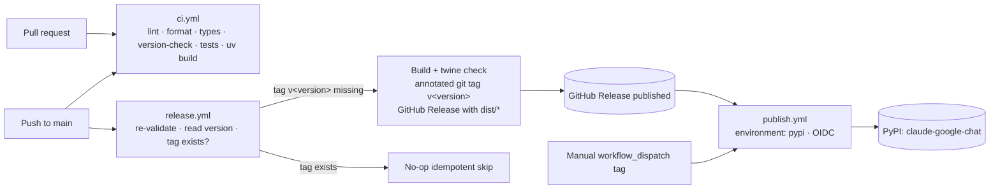

# Architecture

`claude-google-chat` is a single Python package (`claude_google_chat`) exposing the `cgc` CLI, plus a thin Claude Code plugin layer (slash commands + a skill) that shells out to that CLI.

---

## Components

### Plugin layer

- **`commands/*.md`** — slash commands (`chat-setup`, `chat-send`, `chat-listener`). Each becomes `/claude-google-chat:<name>`. They have side effects, so they set `disable-model-invocation: true` and invoke `cgc` via `Bash`.
- **`skills/google-chat/SKILL.md`** — informational skill documenting the ChatOps protocol so Claude can read and produce structured messages. No side effects; model invocation stays enabled.
- **`hooks/hooks.json`** — optional `Stop`-hook ping. It runs `cgc chat send`, which **requires `webhook_url`** (`CGC_WEBHOOK_URL`). Until that value is configured the hook fails fast on every session stop (correct fail-fast behaviour for the command); configure `webhook_url` before relying on the hook, or remove the hook until setup is complete.
- **`.claude-plugin/plugin.json`** / **`marketplace.json`** — plugin and marketplace manifests.

### Python package (`src/claude_google_chat/`)

| Module | Responsibility |
|---|---|
| `messages.py` | **Pure, I/O-free** structured message envelope. `ChatMessage` dataclass, `format_message`, `parse_message`, `message_from_human_text` (catch-all surfacing that never fails fast on plain text), and `to_jsonl` (the single JSON-line serializer for stdout/log output). Single source of truth for the protocol, the status/kind constant sets, and the status→emoji map. |
| `rawmessage.py` | **Pure accessors for raw Chat `messages.list` resources** — `sender_type`/`is_human_message` (loop-prevention sender gating, so the listener never surfaces its own outbound posts or other bots) and `thread_name` (the stable `thread.name` used to filter by, and surface on, the owning thread). Single source of truth used by `listener.py` and `chat.py` (DRY). |
| `resilience.py` | **Transient-vs-fatal error classification** for the poll loop — `is_transient_error` (socket/connection timeouts, dropped connections, Chat API `408`/`429`/`5xx`, `httplib2` transport errors), `is_fatal_error` (auth/permission `401`/`403`), and `diagnostic` (concise, secret-free one-liner that never echoes a URL or response body). Pure and dependency-light. |
| `state.py` | **Durable high-water state** — the `StateStore` protocol with `FileStateStore` (JSON, `0600`, corrupt/missing → fresh start) and `InMemoryStateStore` (injectable test double). Persists the poll cursor so a restart resumes instead of re-emitting. |
| `validation.py` | **Pure shared validators** — `validate_space_id` (`spaces/<id>` form) and `validate_create_time` (RFC3339 `createTime` filter guard). Single source of truth for these format checks, imported by `chat.py` (DRY). |
| `config.py` | **Single config authority.** `Config` frozen dataclass built by `Config.load()`; merges file + env, validates, fails fast on missing required values (`require_keys`), and provides a redacted view for display. Holds every tunable (incl. `webhook_timeout`, `page_size`). |
| `auth.py` | Google **user OAuth** (InstalledAppFlow): `load_credentials`/`login`. Tokens are cached `0600` and never logged. |
| `chat.py` | Network I/O to Google Chat (all user-OAuth): `send_webhook` (outbound via the incoming webhook, no OAuth — optionally threaded via a `thread_key`, returning the created `thread.name`), `list_messages`, and `delete_message` (Chat REST API). Pagination and service construction are factored into shared private helpers (DRY); the webhook HTTP timeout and list page size are config-driven. |
| `polling.py` | **Shared, resilient poll primitive** — `PollLoop` holds the `_seen`/`_since` dedup + high-water bookkeeping, the idle-timeout run loop, and the one-JSON-line-per-message stdout emit used by `listener.py`. Each poll is wrapped so **transient** errors (via `resilience.py`) are logged and skipped, **fatal** auth errors propagate, and after `max_consecutive_errors` consecutive transient failures it raises `PollLoopExhausted` (fail fast); the counter resets on any success. The high-water cursor is loaded from and persisted to an injected `state.StateStore`, so a restart resumes. `run_to_exit_code` maps both idle-timeout and exhaustion to the shared fail-fast exit code. |
| `listener.py` | `Listener(config)` with `iter_new_messages()` — event/poll-driven (over `PollLoop`), env-driven cadence and idle timeout, emits JSON lines to stdout. With `require_trigger` it surfaces only trigger-prefixed messages; without it, every HUMAN message (bots/own posts excluded). When `threads` are configured it further emits only in-thread messages; the owning `thread_name` is carried on every emitted message. Builds a file-backed `StateStore` from `state_file` for durable resume. |
| `cli.py` | Typer `app` wiring the modules into the `cgc` console script (`config`, `auth login`, `chat send`, `listen`, `clear`, `status`, `setup`, `completion`, `--version`). |
| `__main__.py` | `python -m claude_google_chat` → `cli.app()`. |

The package follows SOLID/DRY: `messages.py` is pure and unit-testable, `config.py` is the only place config is resolved, and the protocol constants live in exactly one module.

---

## Data flow

**Outbound (status pings):** Claude runs `/claude-google-chat:chat-send` → `cgc chat send` → `chat.send_webhook` formats a `ChatMessage` via `messages.format_message` and POSTs it to the incoming webhook URL. No OAuth required.

**Inbound (commands):** Claude runs `/claude-google-chat:chat-listener` → `cgc listen` → `listener.Listener` polls the space via the Chat REST API (using OAuth credentials from `auth.load_credentials`), parses each new trigger-prefixed message via `messages.parse_message`, and emits it as a JSON line on stdout for Claude to act on.

---

## Plugin ↔ CLI relationship

The plugin is intentionally thin. All real behavior lives in the `cgc` CLI so it can be used standalone (CI, scripts, hooks) and tested independently of Claude Code. The plugin commands:

- check that `cgc` is on `PATH`,
- pass user input through to the CLI,
- and surface the CLI's output and exit code back to the user.

This keeps a single source of truth for behavior and avoids duplicating logic between the plugin and the CLI.

---

## The structured protocol

The protocol is defined once in `messages.py` and documented for Claude in the `google-chat` skill. The envelope (`version`, `kind`, `status`, `text`, `command`, `args`, `ts`, `correlation_id`, `thread_name`) is used in both directions:

- Outbound `status`/`result` messages are formatted by `format_message`. The first line is always the human summary (emoji + text). The fenced JSON envelope is appended only when `include_envelope=True`; `chat.send_webhook` passes `include_envelope=config.send_envelope`, which defaults to `false` — so the **human-facing Chat view is the clean summary line by default**, and the envelope is opt-in (config `send_envelope` / `CGC_SEND_ENVELOPE`, or `cgc chat send --envelope`).
- The **machine-readable channel** is the JSONL written to stdout by `cgc listen` (`to_jsonl`, one envelope per line) — independent of `send_envelope`, which only affects the Chat text. Each inbound event carries `thread_name`, the owning Chat thread (`null` when unthreaded), so a consumer can route or reply within the right thread.
- Inbound `command` messages are recognized when the text starts with the configured trigger prefix (default `claude:`).

`parse_message` accepts both a trigger-prefixed line and a fenced/bare JSON envelope, and round-trips with the enveloped form of `format_message` for `status`/`result` kinds. Validation is strict and fails fast on an unknown `version`, `kind`, or `status`. See [usage.md](usage.md) for concrete examples and [configuration.md](configuration.md) for the trigger prefix, `send_envelope`, and cadence settings.

---

## Operational properties

- **Fail-fast:** missing required config, non-2xx webhook responses, missing OAuth client files, fatal `401`/`403` auth errors, consecutive-error exhaustion, and idle-timeout expiry all exit non-zero with clear, actionable messages.
- **Resilient polling:** transient backend errors (timeouts, dropped connections, `408`/`429`/`5xx`) are logged and survived; only a configurable run of *consecutive* transient failures (`max_consecutive_errors`) or a fatal auth error stops the loop.
- **Durable resume:** the poll high-water marker is persisted (`state_file`, `0600`), so a restart resumes from the last-processed message instead of re-emitting recent history.
- **No `sleep`-based readiness:** the listener uses an env-driven poll cadence and an idle timeout, never a fixed sleep as a synchronization primitive.
- **Secrets stay secret:** never logged or echoed; transient-error diagnostics carry only the exception type/HTTP status, never a URL or response body; the cached token and state file are written with restrictive permissions; config lives outside the repo.
- **12-factor:** processes externalize their resume state to a backing file, config comes from the environment, logs go to stdout/stderr.

---

## Build, release, and publish pipeline

The project builds once (hatchling, driven by `uv`) and ships that single artifact everywhere — no environment-specific builds. Three GitHub Actions workflows separate **validation**, **release**, and **publish** into distinct stages:

- **`ci.yml` (merge validation):** runs on every pull request and push to `main` across Python 3.11/3.12. Steps: `make install`, `make lint`, `make format-check`, `make typecheck`, a **version-consistency** check (`pyproject.toml [project.version]` must equal `src/claude_google_chat/__init__.py:__version__`), JSON manifest validation, `make test`, `make build`. It never touches PyPI.
- **`release.yml` (validate-on-merge + automated tag release):** on push to `main` it re-validates, reads the version from `pyproject.toml` (single source of truth), and **only if the `v<version>` tag does not already exist** builds + `twine check`s artifacts (`make distcheck`), cuts an **annotated** tag `v<version>`, and creates a **GitHub Release** carrying `dist/*`. Idempotent: an existing tag is a clean no-op (no empty release). Version is bumped manually in `pyproject.toml` + `__init__.py`; the tag is derived from that version (the pyproject version is the single source of truth — no semantic-release dependency).
- **`publish.yml` (PyPI publish):** triggers **only** on a published GitHub Release or manual `workflow_dispatch`, never on pull-request / push-to-main events, so an unconfigured PyPI setup can never block or break merge CI. It validates the tag is semver, re-checks version consistency against the tag, `make distcheck`s, and publishes with `pypa/gh-action-pypi-publish@release/v1` from a GitHub Environment named **`pypi`**, using **OIDC Trusted Publishing** by default (no stored secret; `id-token: write`). An API-token fallback is available behind a commented `password:` line. Setup steps live in [installation.md](installation.md).

The `Makefile` is the single entry point for these stages so local and CI behavior match: `install`, `lint`, `format-check`, `typecheck`, `test`, `build` (`uv build`), `distcheck` (`build` + `uvx twine check dist/*`), and `publish` (`distcheck` + `uv publish`, token from `UV_PUBLISH_TOKEN`, never hardcoded) for validated manual publishing.
