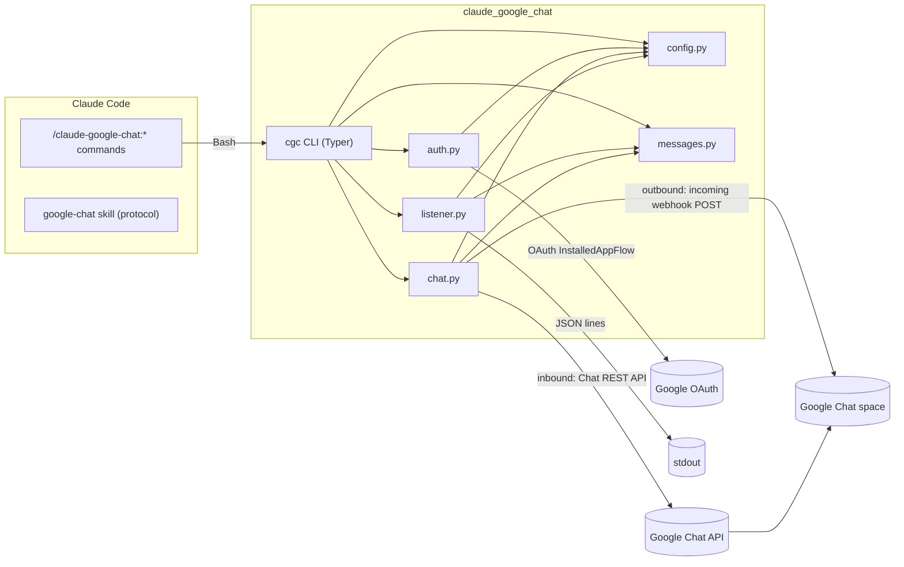
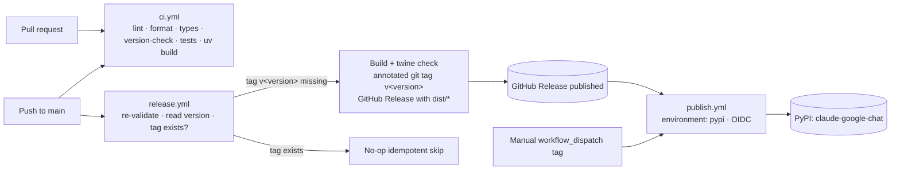

# Architecture

`claude-google-chat` is a single Python package (`claude_google_chat`) exposing the `cgc` CLI, plus a thin Claude Code plugin layer (slash commands + a skill) that shells out to that CLI.

---

## Components

### Plugin layer

- **`commands/*.md`** — slash commands (`chat-setup`, `chat-send`, `chat-listener`). Each becomes `/claude-google-chat:<name>`. They have side effects, so they set `disable-model-invocation: true` and invoke `cgc` via `Bash`.
- **`skills/google-chat/SKILL.md`** — informational skill documenting the ChatOps protocol so Claude can read and produce structured messages. No side effects; model invocation stays enabled.
- **`hooks/hooks.json`** — optional `Stop`-hook ping.
- **`.claude-plugin/plugin.json`** / **`marketplace.json`** — plugin and marketplace manifests.

### Python package (`src/claude_google_chat/`)

| Module | Responsibility |
|---|---|
| `messages.py` | **Pure, I/O-free** structured message envelope. `ChatMessage` dataclass, `format_message`, `parse_message`. Single source of truth for the protocol, the status/kind constant sets, and the status→emoji map. |
| `config.py` | **Single config authority.** `Config` frozen dataclass built by `Config.load()`; merges file + env, validates, fails fast on missing required values, and provides a redacted view for display. |
| `auth.py` | Google auth. **User OAuth** (InstalledAppFlow): `load_credentials`/`login`. **App auth** (service account): `load_app_credentials` for `bootstrap`/`serve`. Never logs tokens or key material. |
| `chat.py` | Network I/O to Google Chat. User-OAuth path: `send_webhook`, `list_messages`, `delete_message`. App path: `build_app_service`, `post_message_as_app`, `list_messages_as_app`. |
| `listener.py` | `Listener(config)` with `iter_new_messages()` — event/poll-driven, env-driven cadence and idle timeout, surfaces trigger-prefixed messages, emits JSON lines to stdout. |
| `bootstrap.py` | **Service-account (app) bootstrap** — the API-level steps Terraform can't do: join/create the Chat space, create the Workspace Events `message.created` → Pub/Sub subscription, and merge results into `config.toml`. Fails fast with exact instructions when the one manual Chat app **Configuration** console step is pending. Pure helpers (`normalize_pubsub_topic`, `build_subscription_body`, `is_not_configured_error`) are unit-tested. |
| `serve.py` | **Always-listening responder** (`cgc serve`). One loop polling the space as the app, one responder per new owner message, structured replies posted (threaded) via the Chat API. Configurable `trigger_prefix`/`poll_interval`/`listen_timeout`/`owner_email`; fetcher/poster/responder injectable for tests. |
| `cli.py` | Typer `app` wiring the modules into the `cgc` console script (`config`, `auth login`, `chat send`, `bootstrap`, `serve`, `listen`, `clear`, `status`, `--version`). |
| `__main__.py` | `python -m claude_google_chat` → `cli.app()`. |

The package follows SOLID/DRY: `messages.py` is pure and unit-testable, `config.py` is the only place config is resolved, and the protocol constants live in exactly one module.

---

## Data flow

**Outbound (status pings):** Claude runs `/claude-google-chat:chat-send` → `cgc chat send` → `chat.send_webhook` formats a `ChatMessage` via `messages.format_message` and POSTs it to the incoming webhook URL. No OAuth required.

**Inbound (commands):** Claude runs `/claude-google-chat:chat-listener` → `cgc listen` → `listener.Listener` polls the space via the Chat REST API (using OAuth credentials from `auth.load_credentials`), parses each new trigger-prefixed message via `messages.parse_message`, and emits it as a JSON line on stdout for Claude to act on.

---

## Plugin ↔ CLI relationship

The plugin is intentionally thin. All real behavior lives in the `cgc` CLI so it can be used standalone (CI, scripts, hooks) and tested independently of Claude Code. The plugin commands:

- check that `cgc` is on `PATH`,
- pass user input through to the CLI,
- and surface the CLI's output and exit code back to the user.

This keeps a single source of truth for behavior and avoids duplicating logic between the plugin and the CLI.

---

## The structured protocol

The protocol is defined once in `messages.py` and documented for Claude in the `google-chat` skill. The envelope (`version`, `kind`, `status`, `text`, `command`, `args`, `ts`, `correlation_id`) is used in both directions:

- Outbound `status`/`result` messages are formatted with a human summary line plus a fenced JSON envelope.
- Inbound `command` messages are recognized when the text starts with the configured trigger prefix.

`parse_message` and `format_message` round-trip for `status`/`result` kinds. Validation is strict and fails fast on an unknown `version`, `kind`, or `status`. See [usage.md](usage.md) for concrete examples and [configuration.md](configuration.md) for the trigger prefix and cadence settings.

---

## Operational properties

- **Fail-fast:** missing required config, non-2xx webhook responses, missing OAuth client files, and idle-timeout expiry all exit non-zero with clear, actionable messages.
- **No `sleep`-based readiness:** the listener uses an env-driven poll cadence and an idle timeout, never a fixed sleep as a synchronization primitive.
- **Secrets stay secret:** never logged or echoed; the cached token is written with restrictive permissions; config lives outside the repo.
- **12-factor:** stateless processes, config from the environment, logs to stdout.

---

## Build, release, and publish pipeline

The project builds once (hatchling, driven by `uv`) and ships that single artifact everywhere — no environment-specific builds. Three GitHub Actions workflows separate **validation**, **release**, and **publish** into distinct stages:

- **`ci.yml` (merge validation):** runs on every pull request and push to `main` across Python 3.11/3.12. Steps: `make install`, `make lint`, `make format-check`, `make typecheck`, a **version-consistency** check (`pyproject.toml [project.version]` must equal `src/claude_google_chat/__init__.py:__version__`), JSON manifest validation, `make test`, `make build`. It never touches PyPI.
- **`release.yml` (validate-on-merge + automated tag release):** on push to `main` it re-validates, reads the version from `pyproject.toml` (single source of truth), and **only if the `v<version>` tag does not already exist** builds + `twine check`s artifacts (`make distcheck`), cuts an **annotated** tag `v<version>`, and creates a **GitHub Release** carrying `dist/*`. Idempotent: an existing tag is a clean no-op (no empty release). Version is bumped manually in `pyproject.toml` + `__init__.py`; the tag is derived from that version, mirroring kanon's "pyproject version drives the tag" mechanism (without requiring semantic-release for this project).
- **`publish.yml` (PyPI publish):** triggers **only** on a published GitHub Release or manual `workflow_dispatch`, never on pull-request / push-to-main events, so an unconfigured PyPI setup can never block or break merge CI. It validates the tag is semver, re-checks version consistency against the tag, `make distcheck`s, and publishes with `pypa/gh-action-pypi-publish@release/v1` from a GitHub Environment named **`pypi`**, using **OIDC Trusted Publishing** by default (no stored secret; `id-token: write`). An API-token fallback is available behind a commented `password:` line. Setup steps live in [installation.md](installation.md).

The `Makefile` is the single entry point for these stages so local and CI behavior match: `install`, `lint`, `format-check`, `typecheck`, `test`, `build` (`uv build`), `distcheck` (`build` + `uvx twine check dist/*`), and `publish` (`distcheck` + `uv publish`, token from `UV_PUBLISH_TOKEN`, never hardcoded) for validated manual publishing.
